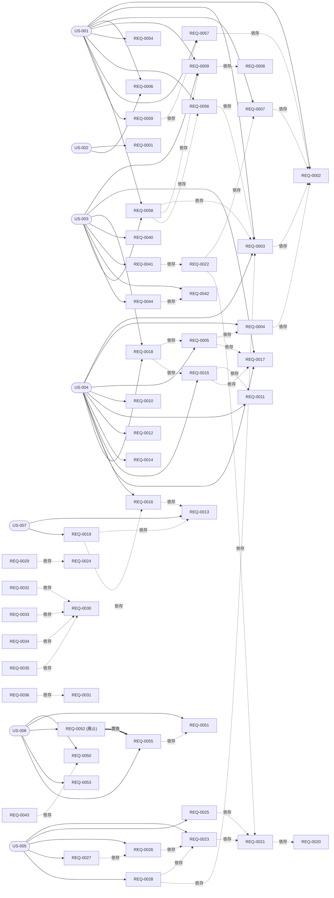

# 要求関係グラフ（自動生成 / 手で編集しないこと）

```mermaid
graph LR
  US_001(["US-001"])
  US_002(["US-002"])
  US_003(["US-003"])
  US_004(["US-004"])
  US_005(["US-005"])
  US_006(["US-006"])
  US_007(["US-007"])
  REQ_0001["REQ-0001"]
  REQ_0002["REQ-0002"]
  REQ_0003["REQ-0003"]
  REQ_0004["REQ-0004"]
  REQ_0005["REQ-0005"]
  REQ_0006["REQ-0006"]
  REQ_0007["REQ-0007"]
  REQ_0008["REQ-0008"]
  REQ_0009["REQ-0009"]
  REQ_0010["REQ-0010"]
  REQ_0011["REQ-0011"]
  REQ_0012["REQ-0012"]
  REQ_0013["REQ-0013"]
  REQ_0014["REQ-0014"]
  REQ_0015["REQ-0015"]
  REQ_0016["REQ-0016"]
  REQ_0017["REQ-0017"]
  REQ_0018["REQ-0018"]
  REQ_0019["REQ-0019"]
  REQ_0020["REQ-0020"]
  REQ_0021["REQ-0021"]
  REQ_0022["REQ-0022"]
  REQ_0023["REQ-0023"]
  REQ_0024["REQ-0024"]
  REQ_0025["REQ-0025"]
  REQ_0026["REQ-0026"]
  REQ_0027["REQ-0027"]
  REQ_0028["REQ-0028"]
  REQ_0029["REQ-0029"]
  REQ_0030["REQ-0030"]
  REQ_0031["REQ-0031"]
  REQ_0032["REQ-0032"]
  REQ_0033["REQ-0033"]
  REQ_0034["REQ-0034"]
  REQ_0035["REQ-0035"]
  REQ_0036["REQ-0036"]
  REQ_0040["REQ-0040"]
  REQ_0041["REQ-0041"]
  REQ_0042["REQ-0042"]
  REQ_0043["REQ-0043"]
  REQ_0044["REQ-0044"]
  REQ_0050["REQ-0050"]
  REQ_0051["REQ-0051"]
  REQ_0052["REQ-0052 (廃止)"]
  REQ_0053["REQ-0053"]
  REQ_0054["REQ-0054"]
  REQ_0055["REQ-0055"]
  REQ_0056["REQ-0056"]
  REQ_0057["REQ-0057"]
  REQ_0058["REQ-0058"]
  REQ_0059["REQ-0059"]
  US_001 --> REQ_0002
  US_001 --> REQ_0003
  US_001 --> REQ_0006
  US_001 --> REQ_0007
  US_001 --> REQ_0009
  US_001 --> REQ_0054
  US_001 --> REQ_0056
  US_001 --> REQ_0057
  US_001 --> REQ_0058
  US_001 --> REQ_0059
  US_002 --> REQ_0001
  US_002 --> REQ_0006
  US_003 --> REQ_0009
  US_003 --> REQ_0017
  US_003 --> REQ_0018
  US_003 --> REQ_0040
  US_003 --> REQ_0041
  US_003 --> REQ_0042
  US_003 --> REQ_0044
  US_003 --> REQ_0058
  US_004 --> REQ_0003
  US_004 --> REQ_0004
  US_004 --> REQ_0005
  US_004 --> REQ_0010
  US_004 --> REQ_0011
  US_004 --> REQ_0012
  US_004 --> REQ_0014
  US_004 --> REQ_0015
  US_004 --> REQ_0016
  US_004 --> REQ_0017
  US_004 --> REQ_0018
  US_005 --> REQ_0023
  US_005 --> REQ_0025
  US_005 --> REQ_0026
  US_005 --> REQ_0027
  US_005 --> REQ_0028
  US_006 --> REQ_0050
  US_006 --> REQ_0051
  US_006 --> REQ_0052
  US_006 --> REQ_0053
  US_006 --> REQ_0055
  US_007 --> REQ_0013
  US_007 --> REQ_0019
  REQ_0003 -.依存.-> REQ_0002
  REQ_0004 -.依存.-> REQ_0002
  REQ_0005 -.依存.-> REQ_0004
  REQ_0005 -.依存.-> REQ_0017
  REQ_0007 -.依存.-> REQ_0002
  REQ_0009 -.依存.-> REQ_0008
  REQ_0015 -.依存.-> REQ_0011
  REQ_0015 -.依存.-> REQ_0017
  REQ_0016 -.依存.-> REQ_0013
  REQ_0018 -.依存.-> REQ_0005
  REQ_0018 -.依存.-> REQ_0015
  REQ_0019 -.依存.-> REQ_0013
  REQ_0019 -.依存.-> REQ_0016
  REQ_0021 -.依存.-> REQ_0020
  REQ_0022 -.依存.-> REQ_0007
  REQ_0022 -.依存.-> REQ_0021
  REQ_0023 -.依存.-> REQ_0021
  REQ_0025 -.依存.-> REQ_0021
  REQ_0026 -.依存.-> REQ_0023
  REQ_0027 -.依存.-> REQ_0026
  REQ_0028 -.依存.-> REQ_0023
  REQ_0028 -.依存.-> REQ_0003
  REQ_0029 -.依存.-> REQ_0024
  REQ_0032 -.依存.-> REQ_0030
  REQ_0033 -.依存.-> REQ_0030
  REQ_0034 -.依存.-> REQ_0030
  REQ_0035 -.依存.-> REQ_0030
  REQ_0036 -.依存.-> REQ_0031
  REQ_0041 -.依存.-> REQ_0022
  REQ_0043 -.依存.-> REQ_0050
  REQ_0044 -.依存.-> REQ_0042
  REQ_0055 -.依存.-> REQ_0051
  REQ_0052 ==置換==> REQ_0055
  REQ_0056 -.依存.-> REQ_0003
  REQ_0057 -.依存.-> REQ_0002
  REQ_0058 -.依存.-> REQ_0003
  REQ_0058 -.依存.-> REQ_0009
  REQ_0058 -.依存.-> REQ_0056
  REQ_0059 -.依存.-> REQ_0057
```
